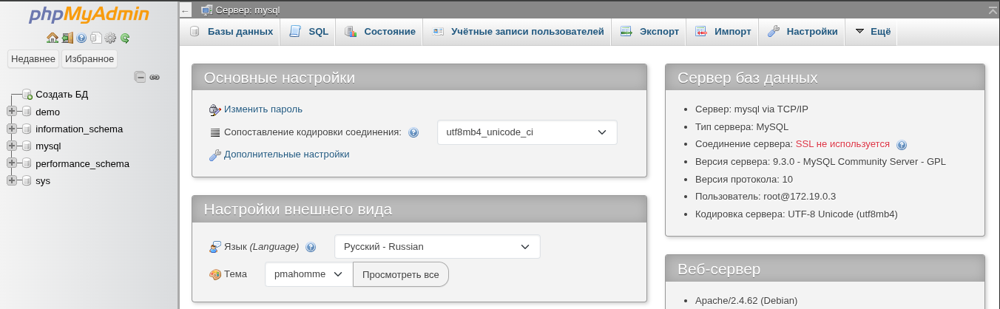
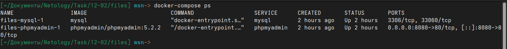
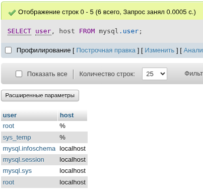
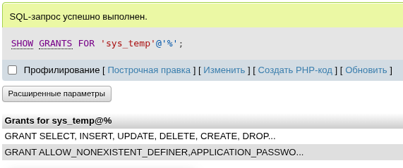
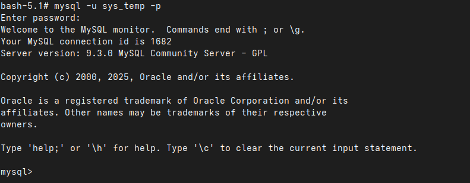
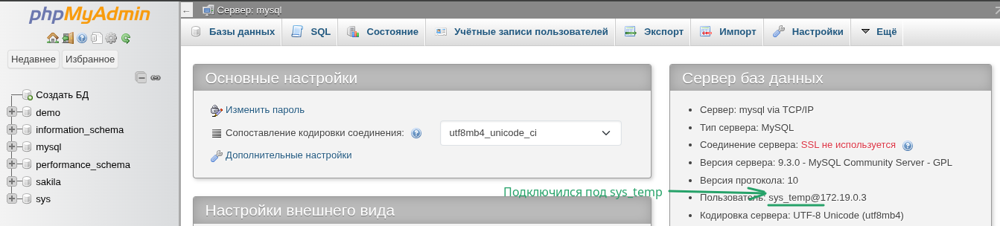
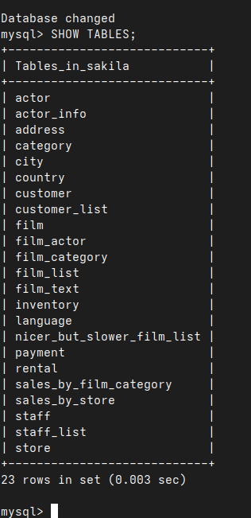

# Домашнее задание к занятию «Работа с данными (DDL/DML)» - Малявко Сергей (netology)

### Задание 1.

1.1. Поднимите чистый инстанс MySQL версии 8.0+. Можно использовать локальный сервер или контейнер Docker.
1.2. Создайте учётную запись sys_temp.
1.3. Выполните запрос на получение списка пользователей в базе данных. (скриншот)
1.4. Дайте все права для пользователя sys_temp.
1.5. Выполните запрос на получение списка прав для пользователя sys_temp. (скриншот)
1.6. Переподключитесь к базе данных от имени sys_temp.
Для смены типа аутентификации с sha2 используйте запрос:
```
ALTER USER 'sys_test'@'localhost' IDENTIFIED WITH mysql_native_password BY 'password';
```

1.6. По ссылке https://downloads.mysql.com/docs/sakila-db.zip скачайте дамп базы данных.
1.7. Восстановите дамп в базу данных.
1.8. При работе в IDE сформируйте ER-диаграмму получившейся базы данных. При работе в командной строке используйте команду для получения всех таблиц базы данных. (скриншот)

### Выполнение задания 1.

1.1 Поднят контейнер c MySQL + phpMyAdmin
##### Скриншот интерфейса phpMyAdmin с поднетым MySQL

##### Скриншот поднятого контейнера MySQL и phpMySQL


1.2 Создаётся учетка командой:
```
CREATE USER 'sys_temp'@'%' IDENTIFIED BY 'temp_password';
```
1.3 Список пользователей:
```
SELECT user, host FROM mysql.user;
```
##### Скриншот списка пользователей из phpMyAdmin


1.4 Все права выдаются командой:
```
GRANT ALL PRIVILEGES ON *.* TO 'sys_temp'@'%' WITH GRANT OPTION;
FLUSH PRIVILEGES;
```
1.5 Запрос на получение списка прав для пользователя sys_temp:
```
SHOW GRANTS FOR 'sys_temp'@'%';
```
##### Скриншот прав из phpMyAdmin


1.6 Подключение под пользователем sys_temp:
```
mysql -u sys_temp -p 
```
##### Скриншот подключение под пользователем sys_temp в консоле

##### Скриншот подключение под пользователем sys_temp к оболочке phpMyAdmin


1.7 Восстановления дампа
##### Скриншот загрузки дампа в MySQL

1.8 Вывод всех таблиц бд из дампа через консоль:
```
USE sakila; 
SHOW TABLES;
```
##### Скриншот всех таблиц из консоли


### Задание 2
Составьте таблицу, используя любой текстовый редактор или Excel, в которой должно быть два столбца: в первом должны быть названия таблиц восстановленной базы, во втором названия первичных ключей этих таблиц. Пример: (скриншот/текст)

### Выполнение задания 2.

#### Список:
| Таблица                      | Первичный ключ   |
|------------------------------|------------------|
| actor                        | actor_id         |
| address                      | address_id       |
| category                     | category_id      |
| city                         | city_id          |
| country                      | country_id       |
| customer                     | customer_id      |
| film                         | film_id          |
| film_actor                   | actor_id, film_id|
| film_category                | film_id, category_id|
| film_text                    | film_id          |
| inventory                    | inventory_id     |
| language                     | language_id      |
| payment                      | payment_id       |
| rental                       | rental_id        |
| staff                        | staff_id         |
| store                        | store_id         |
